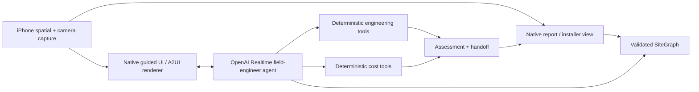

# Architecture

**Status:** active scaffold
**Last updated:** 2026-09-05

## System shape

## Boundaries
- **iPhone capture lane**: ARKit/LiDAR anchors, raycasts, route measurements, selected camera frames, Vision proposals, and user confirmation.
- **Agent lane**: server-owned OpenAI Agents SDK Realtime session for conversation, tool choice, missing-data detection, and explanation.
- **A2UI lane**: a small approved catalog of declarative prompts, forms, confirmations, and results that SwiftUI renders natively; actions return as typed events.
- **Schema lane**: canonical SiteGraph types, enums, units, status, provenance, and validation.
- **Engineering lane**: deterministic charger sizing, service/load screening, and scenario selection.
- **Cost lane**: typed line items, range math, and assumptions.
- **Demo lane**: seeded property, fallback path, and judge-facing script.
- **Docs lane**: repo map, decisions, plan, safety, and status.

## Canonical state principles
- Every meaningful fact is stored as a typed record.
- Facts keep status, source type, confidence, evidence references, timestamps, producer, assumptions, and supersession links.
- Competing observations are preserved; they are not overwritten silently.
- The model may propose facts, but validated tools own authoritative calculations.
- Professional verification is explicit and distinct from model inference.

## SiteGraph v0
Minimum entities:
- site / property / jurisdiction
- spaces and surfaces
- electrical panel and service facts
- proposed EVSE location
- spatial anchors and measurements
- vehicle / charging requirements
- major household loads
- observations and evidence frames
- assumptions, conflicts, and unknowns
- engineering tool runs and results
- regulatory sources and applicability notes
- cost scenarios and line items
- final assessment and handoff payload

## Data flow
1. The user opens the native or web demo shell.
2. The app creates or loads an assessment.
3. Capture tools produce spatial anchors, observations, and evidence references.
4. Vision and the realtime agent may propose facts, but validation converts them to typed state.
5. The agent sees missing data and streams an approved A2UI form or confirmation.
6. Deterministic tools compute charger feasibility and fixture-scoped cost outputs from validated SiteGraph evidence.
7. The Next.js API validates assessment creation and `observation.added` events, then runs timestamp-safe engineering and cost tools and returns the updated SiteGraph from in-memory demo storage.
8. The iPhone renders the returned assessment, tool provenance, cost status, and installer handoff.
9. Fallback data keeps the narrative alive if live capture fails.

## Runtime boundaries
- **Next.js root app**: present demo surface plus in-memory assessment, observation, engineering, and cost API adapters.
- **`apps/server`**: validated in-memory assessment storage and deterministic engineering/cost tools; Realtime and durable persistence remain future work.
- **`apps/ios`**: fixture decoder and four-screen mobile flow; it creates the bundled fixture assessment, runs engineering then cost against a configured demo server, and renders returned results. The updated flow is simulator-verified.
- **`packages/schemas`**: shared Zod types and JSON fixtures.
- **`packages/fixtures`**: golden demo data.

## Reliability and fallback
- Seeded fixtures are the first backup.
- Deterministic tools should accept explicit insufficient-data results.
- OCR and voice should never directly write unchecked values into authoritative state.
- The demo must still tell the story if live voice, OCR, AR tracking, or network is flaky.

## Non-goals for the hackathon slice
- Nationwide code coverage.
- Production auth or billing.
- General multi-agent orchestration.
- Full-house reconstruction.
- VPP economics beyond schema extension points.
