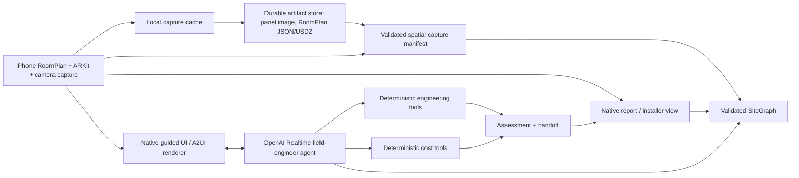

# Architecture

**Status:** active scaffold
**Last updated:** 2026-09-05

## System shape

## Boundaries
- **iPhone capture lane**: one-room RoomPlan capture and local USDZ export are implemented. The native shell can take or select a local panel image after a RoomPlan scan, run local Vision rectangle detection, and submit a validated frame-evidence manifest in the same coordinate-space ID. ARKit/LiDAR anchors, raycasts, object placement/fusion, and confirmation UI remain future work.
- **Artifact lane**: the iPhone retains USDZ assets and sends a RoomPlan USDZ copy to the development Mac's local filesystem before posting a validated capture manifest. The Mac recomputes and returns its byte length/SHA-256 as a `local-mac://` descriptor; SiteGraph retains the descriptor, never large binary payloads. This local-LAN backup is not a production artifact service or agent-readable storage.
- **Agent lane**: the server-owned Realtime client-secret mint boundary and native WebSocket conversation client are implemented. After the short RoomPlan scan, the iPhone opens a live `AVCaptureSession` preview with tap-to-talk controls and still-photo capture; captured frames enter the existing proposed-evidence boundary and are sent to Realtime. The RoomPlan and live camera sessions are sequential, never concurrent. Returned audio transcripts remain visible in the UI. Conversation is open-ended, but the server instruction is backed by a typed consumer-capability allowlist that currently exposes only new Level 2 EV charger assessment and planning. Tool choice, missing-data detection, and typed confirmation integration remain future work.
- **A2UI lane**: a small approved catalog of declarative prompts, forms, confirmations, and results that SwiftUI renders natively; actions return as typed events.
- **Schema lane**: canonical SiteGraph types, enums, units, status, provenance, and validation.
- **Engineering lane**: deterministic charger sizing, service/load screening, and scenario selection.
- **Cost lane**: typed line items, range math, and assumptions.
- **Demo lane**: seeded property, fallback path, and judge-facing script.
- **Docs lane**: repo map, decisions, plan, safety, and status.

## Canonical state principles
- Every meaningful fact is stored as a typed record.
- Facts keep status, source type, confidence, evidence references, timestamps, producer, assumptions, and supersession links.
- Competing observations are preserved; they are not overwritten silently.
- The model may propose facts, but validated tools own authoritative calculations.
- Professional verification is explicit and distinct from model inference.

## SiteGraph v0
Minimum entities:
- site / property / jurisdiction
- spaces and surfaces
- electrical panel and service facts
- proposed EVSE location
- spatial anchors and measurements
- vehicle / charging requirements
- major household loads
- observations and evidence frames
- assumptions, conflicts, and unknowns
- engineering tool runs and results
- regulatory sources and applicability notes
- cost scenarios and line items
- final assessment and handoff payload

## Data flow
1. The user opens the native or web demo shell.
2. The app creates or loads an assessment.
3. The iPhone locally retains a one-room RoomPlan USDZ capture in app support storage and computes an integrity descriptor.
4. The app backs up the RoomPlan USDZ to the development Mac, verifies the returned byte length/SHA-256 against its local copy, then posts a validated metadata-only capture manifest to the assessment API; capture tools will later produce AR anchors, observations, and evidence references.
5. Vision and the realtime agent may propose facts, but validation and user confirmation convert them to typed state.
6. The agent sees missing data and streams an approved A2UI form or confirmation.
7. Deterministic tools compute charger feasibility and fixture-scoped cost outputs from validated SiteGraph evidence.
8. The Next.js API validates assessment creation and typed capture events, then runs timestamp-safe engineering and cost tools and returns the updated SiteGraph.
9. The iPhone renders a guided assessment flow, compact room preview, returned assessment, tool provenance, cost status, and installer handoff.
10. Fallback data keeps the narrative alive if live capture fails.

## Runtime boundaries
- **Next.js root app**: present demo surface plus in-memory assessment, observation, spatial-event, engineering, cost, and local-Mac RoomPlan USDZ-upload adapters. The artifact endpoint writes only to the configured local filesystem and is not an authorized retrieval service.
- **`apps/server`**: validated in-memory assessment storage, spatial capture manifests, deterministic engineering/cost tools, and the local-Mac USDZ upload endpoint; production artifact storage and durable assessment persistence remain future work.
- **`apps/ios`**: fixture decoder and four-screen mobile flow; it creates the bundled fixture assessment, sends RoomPlan capture metadata to the configured demo server, runs engineering then cost, and renders returned results. RoomPlan capture/local USDZ export is implemented; ARKit and panel/camera capture are not.
- **`packages/schemas`**: shared Zod types and JSON fixtures.
- **`packages/fixtures`**: golden demo data.

## Reliability and fallback
- Seeded fixtures are the first backup.
- Deterministic tools should accept explicit insufficient-data results.
- OCR and voice should never directly write unchecked values into authoritative state.
- The demo must still tell the story if live voice, OCR, AR tracking, or network is flaky.

## Non-goals for the hackathon slice
- Nationwide code coverage.
- Production auth or billing.
- General multi-agent orchestration.
- Full-house reconstruction.
- VPP economics beyond schema extension points.
