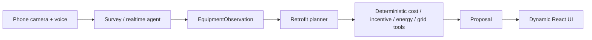

# Architecture

Status: tentative
Last updated: 2026-09-04

Everything here is a documentation example until the challenge prompt and available APIs are confirmed.

## Tentative system flow


## Component boundaries
- **Phone camera + voice**: captures user input and sends it to the app.
- **Survey / realtime agent**: interprets the inputs and produces structured observations.
- **EquipmentObservation**: typed, Zod-validated output from the model boundary.
- **Retrofit planner**: turns observations into candidate options and a recommended path.
- **Deterministic tools**: compute cost, incentive, energy, and grid results without model variability.
- **Proposal**: the assembled recommendation payload that the UI renders.
- **Dynamic React UI**: lets the user inspect and adjust the proposal.
- **Hermes/Codex**: development tooling that builds the app; not shipped to users.
- **OpenAI Agents SDK**: tentative in-app orchestration layer only if it fits the challenge.

## Proposed contracts
These are documentation examples, not implementation.

```ts
import { z } from 'zod';

export const EquipmentObservationSchema = z.object({
  id: z.string(),
  kind: z.enum(['water_heater', 'panel', 'hvac', 'other']),
  label: z.string(),
  confidence: z.number().min(0).max(1),
  evidence: z.array(
    z.object({
      source: z.enum(['image', 'voice', 'manual']),
      note: z.string(),
    })
  ),
  metadata: z.record(z.string(), z.unknown()).optional(),
});
export type EquipmentObservation = z.infer<typeof EquipmentObservationSchema>;

export const RetrofitOptionSchema = z.object({
  id: z.string(),
  name: z.string(),
  summary: z.string(),
  capexUsd: z.number().nonnegative(),
  annualSavingsUsd: z.number().nonnegative(),
  paybackYears: z.number().nonnegative().optional(),
  gridFlexibilityScore: z.number().min(0).max(100),
  assumptions: z.array(z.string()),
});
export type RetrofitOption = z.infer<typeof RetrofitOptionSchema>;

export const CalculationAssumptionsSchema = z.object({
  utilityRateUsdPerKwh: z.number().nonnegative(),
  discountRate: z.number().min(0).max(1),
  horizonYears: z.number().int().positive(),
  incentiveNotes: z.array(z.string()),
  source: z.string(),
});
export type CalculationAssumptions = z.infer<typeof CalculationAssumptionsSchema>;

export const ProposalSchema = z.object({
  observationId: z.string(),
  recommendedOptionId: z.string(),
  options: z.array(RetrofitOptionSchema),
  assumptions: CalculationAssumptionsSchema,
  summary: z.string(),
  warnings: z.array(z.string()),
});
export type Proposal = z.infer<typeof ProposalSchema>;
```

## Data flow
1. User opens the mobile web app and starts the survey.
2. The app captures an image, voice note, or both.
3. The survey agent converts the input into `EquipmentObservation`.
4. The planner assembles candidate retrofit options.
5. Deterministic tools compute costs, incentives, energy, and grid metrics.
6. The app returns a `Proposal` for review in React.
7. The user adjusts one assumption and the proposal recomputes.

## Reliability and fallback design
- Use a fixture image or prerecorded path if the live camera path is unstable.
- Cache one sample result so the demo can continue if the model step stalls.
- Keep calculations deterministic so the same inputs produce the same outputs.
- Surface visible error states instead of hiding failures.
- Preserve a fixture-backed walkthrough for demo day, but disclose when it is used.

## Open questions
- Which official challenge APIs are actually available?
- Is the primary input live camera, uploads, voice, or all three?
- Which retrofit calculations must be model-driven versus deterministic?
- What data sources are allowed for incentives and grid signals?
- Does the challenge require offline fallback or only graceful degradation?
- Is the in-app orchestrator actually needed, or is a simpler route enough?

## Tentative only
Everything above is tentative until the hackathon prompt and available APIs are confirmed. Do not treat this as final architecture.
